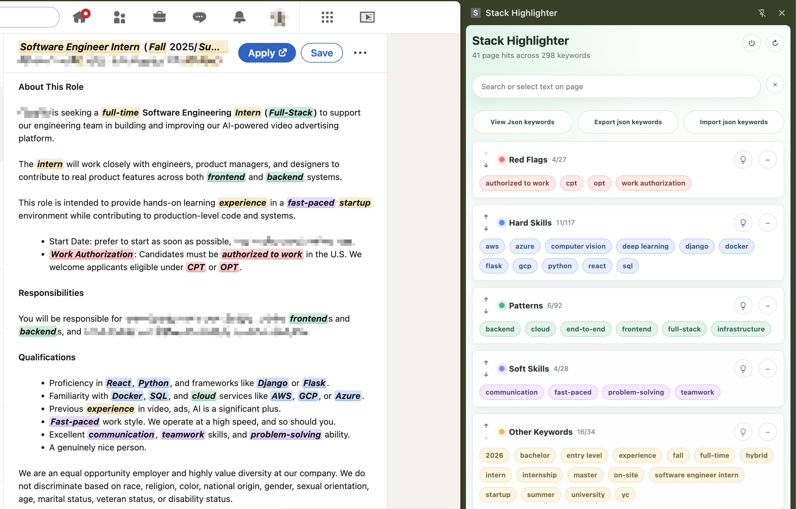

# Stack Highlighter

Stack Highlighter is a small unpacked Chrome extension for job-search reading. It highlights useful terms on the current page and lets you manage keyword bubbles from a right-side Chrome side panel.

## Screenshots



Additional Chrome Web Store screenshots can be placed in `assets/screenshots/`.

- `assets/screenshots/page-highlights.png`: job page with highlighted keywords.
- `assets/screenshots/json-editor.png`: JSON keyword import/export editor.

## What It Does

- Highlights page keywords by category.
- Opens a right-side panel from the extension button.
- Lists keywords as compact color-coded bubbles.
- Puts red flags first and starts every category collapsed.
- Expands or collapses a category by clicking its header area, while `+` still only adds keywords.
- Shows only current-page hits while a category is collapsed; header-only when that category has no page hits.
- Adds keywords from each category header.
- Deletes a keyword from the bubble hover `x`.
- Reorders categories with up/down controls.
- Searches keywords from the top search box.
- Shows short page selections in the panel without changing the current keyword filters.
- Adds selected text through the small `+` button on the chosen category header.
- Uses greedy longest matching, so `React Native` wins over `React` on the page.
- Allows simple plural suffixes, so a `database` keyword can match `databases` while only highlighting the keyword body.
- Colors keywords found on the current page and fades keywords that are in the library but not present on the page.
- Exports and imports the keyword table as JSON.

## Categories

- `Hard Skills`: Python, Java, Go, SQL, Git, Linux, React, AWS, Azure, GCP, Docker, Kubernetes, RAG, LangGraph, and similar technical stack terms.
- `Patterns`: Agile, SDLC, CI/CD, system design, testing, data pipelines, distributed systems, and similar workflow or architecture patterns.
- `Soft Skills`: Self Motivated, Ownership, Collaboration, Communication, Teamwork, and similar human signals.
- `Red Flags`: GC, Green Card, sponsorship, citizen, clearance, and similar terms that deserve careful reading. These are warning signals, not automatic rejection rules.
- `Other Keywords`: Intern, 2026, 2027, Summer, New Grad, and useful context terms.

## Install In Chrome

Stack Highlighter is an unpacked Chrome extension, so it does not need to be published to the Chrome Web Store.

1. Download or clone this repository.
2. Open Chrome and go to `chrome://extensions`.
3. Turn on `Developer mode` in the top-right corner.
4. Click `Load unpacked`.
5. Select the local `stack-highlighter` folder. Select the folder that contains `manifest.json`, not the `src` folder.
6. Open a job page and click the Stack Highlighter extension icon.

If the icon is hidden, open Chrome's extensions menu and pin `Stack Highlighter` to the toolbar.

After changing local files, go back to `chrome://extensions` and click the reload button on the Stack Highlighter card. Then refresh the job page so the content script reloads too.

## How To Use

### Enable Or Disable Highlighting

Use the power button in the top-right corner of the side panel to enable or disable all highlighting. When disabled, existing highlights are removed from the current page and the panel shows a disabled overlay with an `Enable` button.

### Add Keywords From A Page Selection

Select up to five words on the page. The selected text appears near the top of the side panel. Each category header then shows a small green `+`; click the `+` next to the category where the selected keyword should be added.

Selected keywords are cleaned before saving. Leading/trailing spaces and simple trailing punctuation are removed, and keywords are stored in lowercase.

### Delete Keywords

Hover over a keyword bubble and click the `x` on the bubble. The page refreshes its highlights after the keyword is removed.

### View All Keywords In A Category

Categories start collapsed. Click a category header to expand it and view all keywords in that category. Click the header again to collapse it back to the page-hit view.

### Temporarily Disable A Category

Click the lightbulb button on a category header to disable or enable that category. Disabled categories stay collapsed and do not highlight keywords on the page.

### Backup Keywords

Click `Export json keywords` to download the current keyword table as a JSON backup.

### Restore Keywords

Click `Import json keywords` and choose a previously exported JSON file. Invalid JSON or duplicate category names are rejected.

### Advanced JSON Customization

Click `View Json keywords` to edit the keyword table directly. The JSON format contains category `name`, `color`, `enabled`, and `keywords` fields. Click `Save` to validate and apply the edited JSON.

### Add Or Delete Categories

Category add/delete is available but still being tested. Use the large `+` at the bottom of the panel to add a category. Use the `−` button on a category header to delete a category; export a JSON backup first because category deletion cannot be undone.

## Privacy And Permissions

Stack Highlighter is local-first. Keyword data and enabled/disabled state are stored in Chrome extension storage. The extension does not send job-page text or keyword data to a server.

The manifest currently uses broad page access so the content script can highlight keywords on arbitrary job pages. For Chrome Web Store submission, consider narrowing this permission or using active-tab injection to reduce review friction.

## License

MIT License. See [LICENSE](LICENSE).

## Development

This project intentionally has no build step. Chrome loads the files directly:

- `manifest.json`: Chrome MV3 configuration.
- `sidepanel.html`: right panel entrypoint.
- `src/sidepanel.js`: keyword management UI.
- `src/contentScript.js`: page selection capture and highlighting.
- `src/shared.js`: keyword defaults, cleaning, filtering, and matching helpers.
- `src/content.css`: highlight styles injected into web pages.
- `src/sidepanel.css`: panel visual design.

Run the lightweight checks with:

```bash
node tests/shared.test.js
node --check src/shared.js
node --check src/contentScript.js
node --check src/sidepanel.js
node --check src/background.js
```
